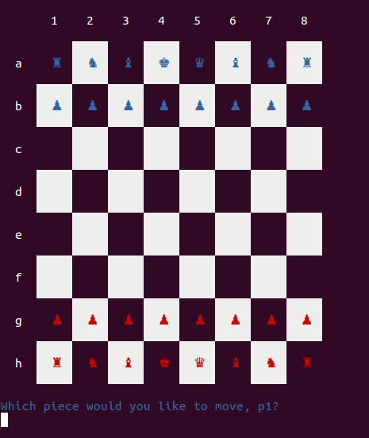

#Chess

###Instructions:  
To initialize the game from project directory  
$ ruby game.rb  

Blue moves first.  

### Features:
  * class based hierarchy
  * piece movement is constrained to legal moves
  * checks for checkmate

### Places to read code
  * game.rb sets the board and defines player turns
  * piece.rb shows the logic behind abstract pieces
  * grid.rb contains the logic to access grid squares

### Sample code
'''ruby
def enemy?(pos)
  return false if empty?(pos)
  board[*pos].color != self.color
end

def empty?(pos)
  board[*pos].nil?
end

def can_move_to?(pos)
  empty?(pos) || enemy?(pos)
end

'''
